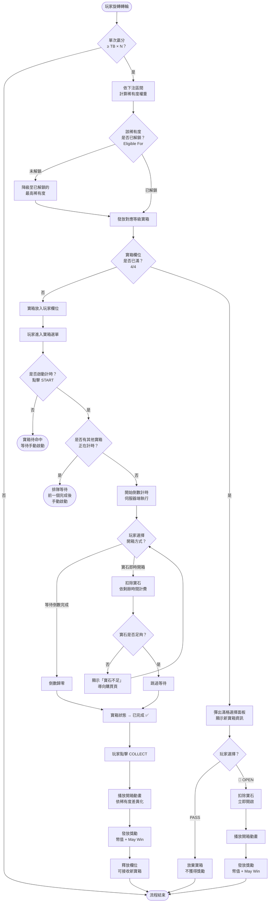

# 03 · 觸發流程

[← 回目錄](../README.md)

---

## 3.1 流程圖

---

## 3.2 流程階段說明

### 階段一：觸發判定

| 步驟 | 說明 |
|------|------|
| 轉輪旋轉 | 玩家執行一般 Spin |
| 贏分倍率判定 | 系統判定本次贏分是否 ≥ Total Bet × N（觸發倍率門檻） |

### 階段二：寶箱發放

| 步驟 | 說明 |
|------|------|
| 稀有度計算 | 依當次 Total Bet 所在下注區間，計算各已解鎖稀有度的機率權重 |
| 資格檢查 | 確認抽中的稀有度在當前下注區間已解鎖（Eligible For） |
| 欄位檢查 | 若欄位未滿 → 寶箱入袋；若已滿 → 彈出滿格選擇面板 |

### 階段二 A：滿格選擇

| 步驟 | 說明 |
|------|------|
| 彈出面板 | 顯示新寶箱稀有度、WIN AT LEAST 保證幣值、MAY WIN 預覽 |
| PASS | 玩家放棄此寶箱，不獲得獎勵，面板關閉 |
| 💎 OPEN | 玩家花費寶石立即開啟，**不占用欄位**，直接播放開箱動畫並發放獎勵 |

### 階段三：計時與開箱（一般流程）

| 步驟 | 說明 |
|------|------|
| 啟動計時 | 玩家手動點擊 START，開始伺服器端倒數 |
| 單一計時限制 | 同一時間僅允許 1 個寶箱倒數 |
| 開箱選擇 | 等待倒數完成（免費）或使用寶石即時開啟（付費） |
| 寶石費用 | 依剩餘時間計算，最低 1 顆寶石 |

### 階段四：獎勵發放

| 步驟 | 說明 |
|------|------|
| 收取操作 | 倒數完成後玩家點擊 COLLECT |
| 開箱動畫 | 依稀有度播放對應動畫（詳見 [05-演出動態](05-animations.md)） |
| 獎勵結算 | 發放保證幣值 + 機率性 May Win 額外獎勵 |
| 欄位釋放 | 該寶箱位置清空，可接收新寶箱 |

---

## 3.3 關鍵分支彙整

| 分支情境 | 系統行為 | UI 回饋 |
|---------|---------|---------|
| 贏分未達 N 倍門檻 | 流程不進入寶箱系統 | 無 |
| 欄位已滿（4/4） | 寶箱仍發放，彈出滿格選擇面板 | PASS（放棄）或 💎 OPEN（寶石即開） |
| 玩家選擇 PASS | 放棄寶箱，不獲得獎勵 | 面板關閉，回到遊戲 |
| 玩家選擇 💎 OPEN | 扣除寶石，立即開箱，不占欄位 | 播放開箱動畫 + 發放獎勵 |
| 已有寶箱正在計時 | 新寶箱無法啟動計時 | 排隊等待，需手動啟動 |
| 寶石不足 | 無法即時開箱 | 顯示「寶石不足」+ 導向購買頁 |
| App 關閉 / 斷線 | 伺服器端計時持續 | 重開後顯示正確剩餘時間或已完成 |
| 倒數完成未收取 | 寶箱保持已完成狀態 | 顯示 COLLECT 按鈕，不過期 |

---

[← 觸發條件](02-trigger-conditions.md) ｜ [下一章：介面顯示 →](04-ui-display.md)
